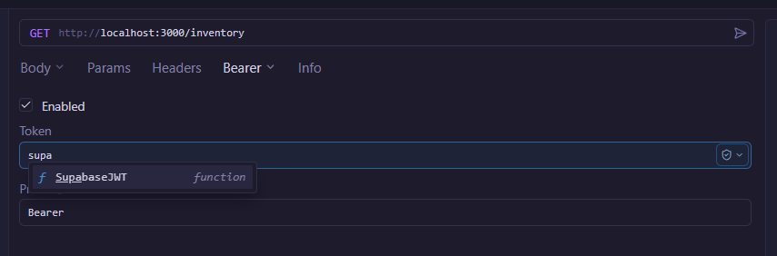
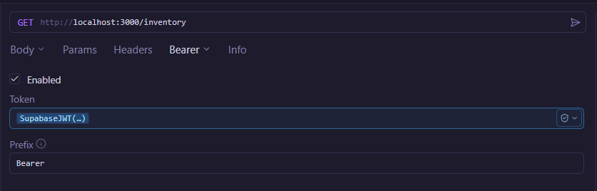
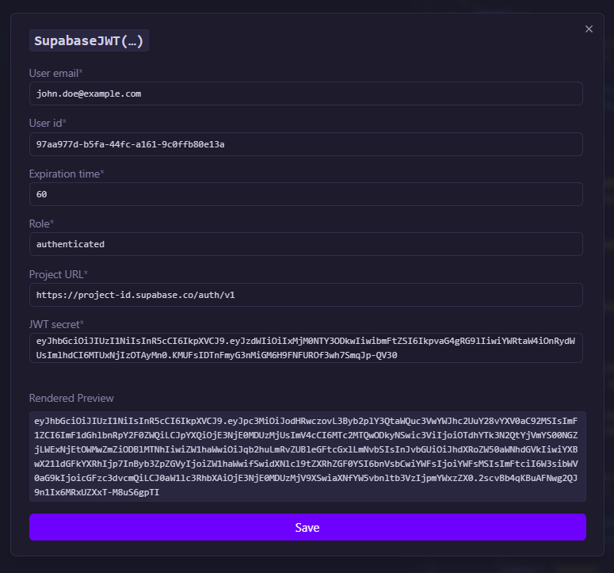

# Supabase JWT Generator

A plugin for Yaak that generates a signed JWT for Supabase based on an email, role, expiration time, and your JWT secret.  
Ideal for quickly generating test tokens inside Yaak and using them in your requests.

This is the Yaak equivalent of the [insomnia-plugin-supabase-jwt-generator](https://github.com/hatxor/insomnia-plugin-supabase-jwt-generator).

## Installation

### From Yaak Settings

1. Open Yaak.
2. Go to **Settings** → **Plugins**.
3. Search for **Supabase JWT Generator**.
4. Click **Install**.

## Usage

In your workspace, open **Variables** or go directly to a request where you want to use a token.

Select the `SupabaseJWT` plugin.

Fill in the required values. The plugin will generate the token, which you can then inspect or use directly.

Send your request, and the token will be applied.

## Details

- Uses the **HS256** algorithm.
- It uses the `fast-jwt` library for signing.

Thanks for using this plugin—happy token generation! 🎉